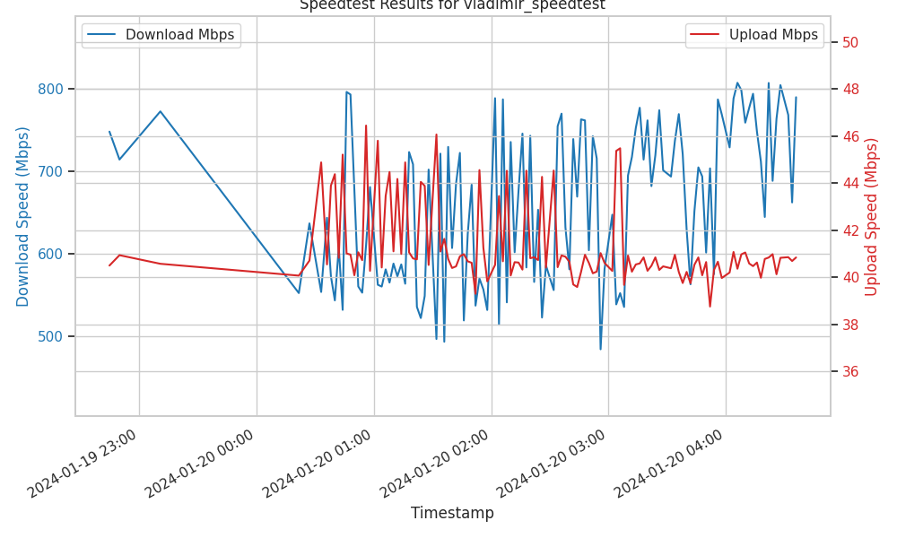

# Speedtest-Results

## Overview
**Speedtest-Results** is a Python 3 application designed to display results from **speedtest-cli** results logged into a MariaDB database. It's a practical tool for monitoring and archiving your internet speed tests.

---

### Getting Started

#### Prerequisites
- Python 3
- `pip3`
- MariaDB/MySQL database

#### Dependencies
- `pymysql`

Install them using:
```bash
pip3 install pymysql
```

#### Configuration
Create a `config.ini` in the same directory as `speedtest_results.py with the following content:

```ini
[database]
host=192.168.1.110
port=3306
user=speedtest
password=enter.your.password.here.
```
Ensure the `[database]` section and each parameter name remain as is.

#### Initialization
Initialize and activate the Python environment:

```bash
python3 -m venv speedtest-results
source speedtest-results/bin/activate
cd speedtest-results
./speedtest_results.py
```

---

### Sample Plots
Here are some sample plots generated by **Speedtest-Results**:



*host is collecting data at 3 min intervals*


*host is collecting data at 15 minute intervals*

---

### Feedback
As a novice enthusiastic about improving, I'm open to feedback and suggestions. Feel free to drop me a note at gitdevfeedback@rejecth0.com.

---

### Disclaimer
This is a personal project, so please use it at your own risk. If you encounter any issues, remember, even Linus Torvalds might need to show mercy!

---

### Cheers!
Happy testing and may your internet speeds always be in your favor!
